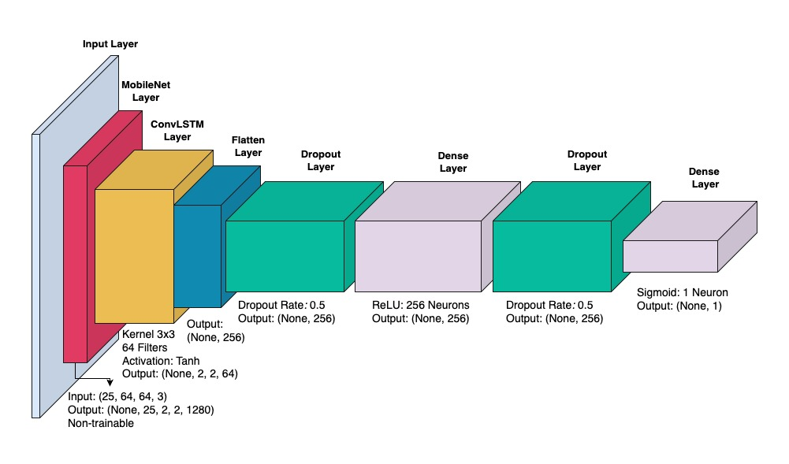

# precognet
Lightweight model for violence detection using MobileNet ConvLSTM.

## Results

### Parameters

| **Description**          | **Count**                 | **Size (MB)**       |
|--------------------------|---------------------------|---------------------|
| Trainable Parameters     | 3,162,881 parameters      | 12.07               |
| Non-Trainable Parameters | 2,257,984 parameters      | 8.61                |
| Optimizer Parameters     | 6,325,764 parameters      | 24.13               |
| Architecture & Metadata  | N/A                       | 2.79                |
| Total                    | 11,746,629 parameters     | 47.60               |
| **Final**                | **5,420,865 parameters**  | **20.68**           |

### Overall Metrics

| **Fold** | **Accuracy** | **Precision** | **Recall** | **F1-score** | **AUC**   | **Training Time**   |
|--------------|--------------|--------------|------------|--------------|-----------|----------------------|
| 1            | 96.62%       | 97.13%       | 96.08%     | 96.60%       | 96.62%    | 1257.10 seconds     |
| 2            | 96.12%       | 94.74%       | 97.66%     | 96.18%       | 96.12%    | 1256.20 seconds     |
| 3            | 95.50%       | 95.42%       | 95.58%     | 95.50%       | 95.50%    | 1243.04 seconds     |
| 4            | 95.80%       | 97.24%       | 94.25%     | 95.72%       | 95.80%    | 1240.36 seconds     |
| 5            | 95.91%       | 94.57%       | 97.41%     | 95.97%       | 95.91%    | 1237.77 seconds     |

## Ablation

## Conclusion
